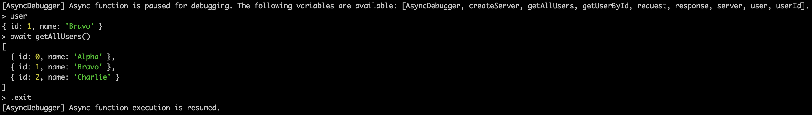

# AsyncDebugger

[](https://www.npmjs.com/package/async-debugger)
[](https://github.com/semantic-release/semantic-release)

Babel plugin and utilities for running async code at breakpoints. Plus REPL console for debugger statements in Node.

## Installation and Usage

```bash
yarn add --dev async-debugger
```

Transpile your code with `async-debugger/babel-plugin`. See examples on how to do it [below](#examples).

Use `await 'debugger'` statement instead of a regular `debugger` in async functions.

When this statement is reached, the function execution will be paused and you will be able to debug it and run async code in browser console or node REPL.

Example on CodeSandbox - https://codesandbox.io/s/async-debugger-react-webpack-example-7oke6

## Problem

In JavaScript it is not possible to run async code when execution is paused at a breakpoint (e.g. with `debugger` statement).

Thus it is impossible to test any async code in browser console when debugging/developing.

## Solution

AsyncDebugger pauses async functions when they reach the debugger statement and does not block async JS execution.

The access to the variables in the scope is ensured by the babel plugin it implements.

For example, the code below:

```javascript
const a = "abc";
let b = 123;
await "debugger";
```

will transpile to (n.b. the actual implementation is different):

```javascript
import { debugAsync } from "async-debugger";

const a = "abc";
let b = 123;
await debugAsync({ a, b });
```

`debugAsync` in its turn will expose the variables to the global object and REPL console in Node.

## Examples

### In Node

Create a file `server.js` as follows:

```javascript
const { createServer } = require("http");

const getAllUsers = async () => {
  await new Promise((resolve) => setTimeout(resolve, 500));
  return [
    { id: 0, name: "Alpha" },
    { id: 1, name: "Bravo" },
    { id: 2, name: "Charlie" },
  ];
};
const getUserById = async (id) => {
  const allUsers = await getAllUsers();
  return allUsers.find((user) => user.id === id);
};

const server = createServer(async (request, response) => {
  try {
    const userId = +request.url.split("/").pop();
    const { name } = await getUserById(userId);

    await "debugger"; // <-- it will await until REPL is closed.

    response.write(name);
  } catch (error) {
    response.statusCode = 500;
    response.write(String(error));
  } finally {
    response.end();
  }
});
server.listen(3000, () => console.log("Listening on", server.address()));
```

To enable AsyncDebugger you can run it like this:

```bash
node --require async-debugger/register --experimental-repl-await server.js
# Or with `ts-node`:
# NODE_OPTIONS="--experimental-repl-await" ts-node --require async-debugger/register server.ts
```

Then make a GET request to `http://localhost:3000/users/1` and use the REPL launched automatically in your terminal:



Alternatively, you can add `--inspect` flag when running node and use AsyncDebugger in a browser console. More in https://nodejs.org/en/docs/guides/debugging-getting-started/

### In Browser

Add Babel for javascript/typescript files transpilation and include `async-debugger/babel-plugin` to the list of plugins.

On `await 'debugger'` statement in the async function it will be paused and you will be able to debug it in the browser console.

Available plugin options:

- `debugAsyncDeclarationHeader` - code that will be inserted in the beginning of any file that has `await 'debugger'` statements.
  It will declare `__debugAsync__` function if it is not already declared in the debugged scope.
  You can also set `debugAsyncDeclarationHeader` to an empty string and define `__debugAsync__` in the global scope manually.
  Default value is `const {debugAsync: __debugAsync__} = require('async-debugger');`.

See an example for React and Webpack [above](#installation-and-usage).
